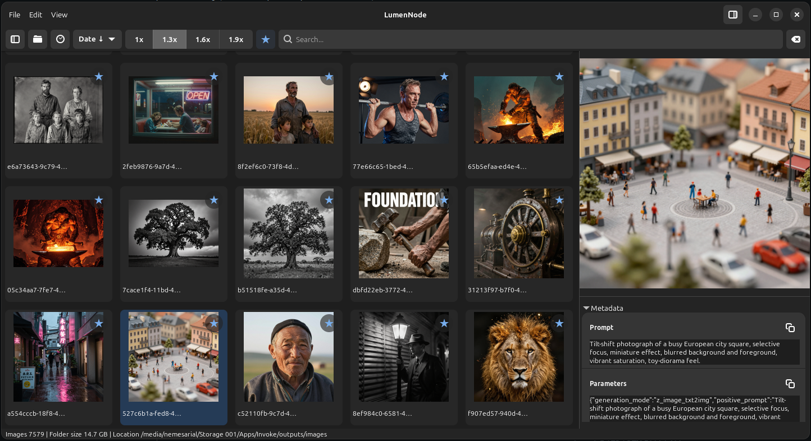

<div align="center">

```
██╗     ██╗   ██╗███╗   ███╗███████╗███╗   ██╗    ███╗   ██╗ ██████╗ ██████╗ ███████╗
██║     ██║   ██║████╗ ████║██╔════╝████╗  ██║    ████╗  ██║██╔═══██╗██╔══██╗██╔════╝
██║     ██║   ██║██╔████╔██║█████╗  ██╔██╗ ██║    ██╔██╗ ██║██║   ██║██║  ██║█████╗
██║     ██║   ██║██║╚██╔╝██║██╔══╝  ██║╚██╗██║    ██║╚██╗██║██║   ██║██║  ██║██╔══╝
███████╗╚██████╔╝██║ ╚═╝ ██║███████╗██║ ╚████║    ██║ ╚████║╚██████╔╝██████╔╝███████╗
╚══════╝ ╚═════╝ ╚═╝     ╚═╝╚══════╝╚═╝  ╚═══╝    ╚═╝  ╚═══╝ ╚═════╝ ╚═════╝ ╚══════╝
```

**A fast, beautiful image gallery for photographers and AI artists — built in Rust with GTK4.**

[](https://www.rust-lang.org/)
[](https://gtk.org/)
[](https://gnome.pages.gitlab.gnome.org/libadwaita/)
[](LICENSE)

</div>

<p align="center">
  
</p>

---

## Why LumenNode Exists

I have a large library of AI-generated images and couldn't find a viewer that actually understood them. Every gallery I tried would show the image, but none of them surfaced the generation metadata — the prompts, seeds, samplers, and workflow details embedded in the PNG chunks. If I wanted to re-run or tweak a generation, I had to dig through raw file properties or keep separate notes.

LumenNode was built to fix that. It's the image viewer I wanted: fast thumbnail browsing with a metadata panel that reads directly from the AI tool that created each image, so the prompt and seed are always one click away.

---

## TL;DR

> Browse thousands of images without waiting. LumenNode loads thumbnails progressively, caches metadata in a per-folder SQLite database, and surfaces AI-generation prompts, seeds, and workflow details from PNG images — so you can copy a prompt and re-run a generation in one click.

- **What**: GTK4 desktop image gallery for Linux
- **Who**: Photographers and AI artists (Stable Diffusion, ComfyUI, InvokeAI)
- **Why**: Most galleries don't understand AI metadata. LumenNode does.
- **How fast**: Folder opens instantly. Thumbnails load in the background. Metadata is cached.
- **Key power**: Right-click → *Copy Prompt / Copy Seed / Copy Generation Command*

```bash
make build && make run    # that's it
```

---

## Contents

- [Screenshots](#screenshots)
- [Features](#features)
- [Installation](#installation)
- [Building from Source](#building-from-source)
- [Usage](#usage)
- [AI Metadata Support](#ai-metadata-support)
- [Keyboard Shortcuts](#keyboard-shortcuts)
- [Configuration](#configuration)
- [Architecture](#architecture)
- [Internals Deep-Dive](#internals-deep-dive)
- [Roadmap](#roadmap)
- [Module layout (developer)](ARCHITECTURE.md)

---

## Screenshots

Current UI screenshot:


---

## Features

### The essentials

| | Feature |
|---|---|
| ⚡ | **Progressive loading** — folder opens instantly, thumbnails fill in behind |
| 🖼️ | **Grid + single-view + compare** — grid for browsing, click for focus, Escape to return; pin a reference for side-by-side compare (lock-left); empty grid shows guidance (open folder, no images, no matches) |
| 📐 | **4 thumbnail sizes** — 128px base with larger steps up to 240px (128, 160, 208, 240), adjustable in one click |
| 🔍 | **Live search** — filters grid by filename, tags, and metadata in real time |
| 🏷️ | **Free-form tags** — assign tags from the thumbnail chrome pane (filterable checkboxes + Add), context menu, or `Ctrl+Shift+T`; filter with the header tag popover (AND); persisted per folder |
| ↕️ | **6 sort modes** — name, date, size (ascending and descending) |
| 💾 | **Session persistence** — window, pane positions, recent folders, and theme preference (`color_scheme`) in `~/.lumen-node/config.yml`; sort, search, and thumbnail size per folder in `.lumen-node.db` (`ui_state`). Optional YAML startup defaults and editor/HUD keys are editable via **Edit → Preferences…** (partial writes; unknown keys preserved) |
| 🌓 | **Theme toggle** — header icon cycles System → Light → Dark (libadwaita color scheme) |

### For AI artists

| | Feature |
|---|---|
| 🤖 | **Auto1111 / SD WebUI** — extracts prompt, seed, steps, sampler from PNG `parameters` |
| 🌊 | **ComfyUI** — parses `prompt` JSON (positive + negative) and `workflow` node summaries |
| 🎨 | **InvokeAI** — reads `invokeai_metadata` JSON for structured prompt + model info |
| 📋 | **One-click copy** — prompt, negative prompt, seed, or full generation command |
| 🔁 | **CLI reconstruction** — right-click → *Copy Generation Command* builds `--prompt "..." --negative "..." --seed X` |
| 🔗 | **Similar in folder** — after enrichment, find near-duplicate prompts / same-seed variants (context menu or metadata pane); temporary grid filter, clear with × / toast / empty-state |

### For photographers

| | Feature |
|---|---|
| 📷 | **EXIF extraction** — camera make/model, exposure time, ISO sensitivity |
| 📁 | **Folder tree sidebar** — single-click to browse; double-click to set as root |
| 🗄️ | **Per-folder cache** — `.lumen-node.db` lives next to your images, no central index |
| ♻️ | **Refresh controls** — force re-thumbnail or re-index single images or entire folders |

---

## Installation

### From AppImage (recommended)

```bash
chmod +x LumenNode-x86_64.AppImage
./LumenNode-x86_64.AppImage
```

### Install to `~/.local` (desktop integration)

```bash
git clone https://github.com/mholtzhausen/lumen-node.git
cd lumen-node
make install
```

This installs the binary, `.desktop` file, SVG icon, and AppData metainfo so LumenNode appears in your application launcher.

---

## Building from Source

### Prerequisites

```bash
# Debian / Ubuntu
sudo apt install libgtk-4-dev libadwaita-1-dev pkg-config build-essential

# Fedora
sudo dnf install gtk4-devel libadwaita-devel pkg-config

# Arch
sudo pacman -S gtk4 libadwaita pkg-config
```

You also need a stable Rust toolchain:

```bash
curl https://sh.rustup.rs -sSf | sh
```

### Build

```bash
make build      # debug build
make check      # fast type-check, no binary produced
make run        # build + run
make clean      # wipe build artifacts
```

Additional Makefile targets for packaging and maintenance: `uninstall`, `appimage`, `release`, `release-preflight` (see `Makefile`).

> **Prefer `make`** for builds: the Makefile exports `PKG_CONFIG_PATH` so `pkg-config` finds GTK4/libadwaita on Debian-like systems. If your distro already resolves those packages, `cargo build` may work; match the Makefile’s `PKG_CONFIG_PATH` when linking fails.

### GTK4 starter pack

To bootstrap a **new** Rust + GTK4/libadwaita app with the same threading, channel, and packaging patterns as LumenNode, copy [`pack/rust-gtk4-starter/`](pack/rust-gtk4-starter/) (see [`pack/README.md`](pack/README.md) and [`PITFALLS.md`](pack/rust-gtk4-starter/PITFALLS.md)).

---

## Usage

### Opening a folder

Click **Open Folder** in the header bar, or simply launch the app — it reopens the last **tree root** (the folder that anchors the sidebar). Open Folder, history, and session restore all set that root and show its images in the grid.

### Folder tree

```
Single-click folder  → show that folder’s images in the grid (sidebar root unchanged)
Double-click / Enter → make that folder the new sidebar root (and show its images)
```

### Navigating

```
Grid view                Single view              Compare view
─────────────────────    ─────────────────────    ─────────────────────
Click image     → focus  Left / Right  → prev/next Left / Right  → right pane only
Page Up/Down    → page   Escape        → grid     Escape        → single (unpin)
Home / End      → ends
```

### Side-by-side compare

1. Right-click an image → **Pin for compare** (pins that image on the left and opens compare mode).
2. Left/Right arrows or plain scroll advance the **right** pane only; the left reference stays pinned.
3. Each pane zooms independently (`Ctrl+scroll` on that pane; `+/-` / `0` target the right pane).
4. Exit: **Escape** (compare → single, then Escape again → grid), context menu **Exit compare**, or middle-click either compare pane → grid.

### The context menu

Right-click any image thumbnail, the single-view / compare image, or the sidebar preview. Sections match the live `gio::Menu` in `src/ui/actions.rs`:

- **Prompt:** Copy Prompt, Copy Negative Prompt, Copy Seed, Copy Generation Command (rebuilds a CLI-style invocation), Similar in folder (temporary grid filter by prompt-token Jaccard + same-seed boost)
- **Clipboard:** Copy Image (pixels), Copy Path, Copy Metadata
- **Open:** Open in File Manager, Open in External Editor (optional `external_editor` in config; otherwise the default image app)
- **Organise:** Favourite (toggle), Add tag / Remove tag, Pin for compare, Exit compare, Move to Trash
- **Refresh** (submenu): Refresh Thumbnail, Refresh Metadata, Refresh Folder Thumbnails, Refresh Folder Metadata

Hovering a grid thumbnail (or selecting / favouriting it) shows a right-hand chrome pane with favourite and tags buttons. The tags button opens a short filterable checklist of folder tags; type a new name to get **Add `foo`**.

**Similar in folder** is enabled when the selection has a prompt or raw parameters. The metadata pane shows a **Similar** button next to the Prompt (or Parameters) row. The filter ANDs with search / favourites / tags; clear it via the header × button, the toast’s Clear action, or the empty-state “Clear filters” CTA.

### Pane layout

```
┌──────────────────────────────────────────────────────┐
│  [Open Folder]  │  [Sort ▾] [Search ___] [×]  │ ◧ ◨ │  ← header
├──────────┬──────────────────────────┬───────────────┤
│  Folder  │                          │  Metadata     │
│  Tree    │   Image Grid / Preview   │  Sidebar      │
│          │                          │               │
│          ├──────────────────────────┤               │
│          │   Sidebar Detail / Meta  │               │
├──────────┴──────────────────────────┴───────────────┤
│  ████████████████░░░░  Enum a/b | Thumbs a/b | Index a/b (gen g, cached c) │  ← progress while scanning
└──────────────────────────────────────────────────────┘
```

While a folder scan is active, the footer shows **Enum**, **Thumbs**, and **Index** counts plus how many enrichments were generated vs served from cache. When the progress bar hides (idle), the same line shows image count, human-readable folder size, and the folder path.

The `◧` and `◨` buttons in the header toggle the folder tree and metadata panes. All three dividers are draggable; proportions are saved on exit.

---

## AI Metadata Support

LumenNode reads PNG text chunks (`tEXt`, `zTXt`, `iTXt`) written by AI generation tools, and can combine them with camera EXIF from a PNG **eXIf** chunk when present. No configuration needed — it detects the format automatically.

### Automatic1111 / Stable Diffusion WebUI

```
tEXt chunk key: "parameters"

a beautiful landscape, oil painting style
Negative prompt: ugly, blurry, low quality
Steps: 20, Sampler: DPM++ 2M Karras, CFG scale: 7,
Seed: 1234567890, Size: 512x512, Model: v1-5-pruned
```

Extracted: **positive prompt**, **seed** (from `Seed: NNN`), raw parameters block.

### ComfyUI

```
tEXt chunk key: "prompt"    ← node graph JSON (API format)
tEXt chunk key: "workflow"  ← UI workflow JSON
```

For `"prompt"` JSON, LumenNode finds all `CLIPTextEncode` nodes and assigns positive/negative using node id, title, and `_meta.title` signals (with text length as a tiebreaker). For `"workflow"` JSON, it generates a human-readable node summary.

### InvokeAI

```
tEXt chunk key: "invokeai_metadata"

{
  "positive_prompt": "...",
  "negative_prompt": "...",
  "model": { "name": "...", "base": "sd-1" },
  ...
}
```

Extracted: **positive prompt**, **negative prompt**, model info, raw JSON.

---

## Keyboard Shortcuts

| Key | Context | Action |
|-----|---------|--------|
| `Page Up` | Grid | Scroll one page up |
| `Page Down` | Grid | Scroll one page down |
| `Home` | Grid | Jump to first image |
| `End` | Grid | Jump to last image |
| `Escape` | Grid | Quit (toast warns, second press confirms) |
| `←` / `→` | Single view | Previous / next image |
| `←` / `→` | Compare view | Previous / next on the **right** pane only (left stays pinned) |
| `Escape` | Compare view | Exit compare → single view (clears pin) |
| `Escape` | Single view | Return to grid |
| `+` / `-` (or keypad) | Preview, single, or compare (right pane; not in a text field) | Zoom in / out (fit-to-display is the default) |
| `0` (or keypad) | Preview, single, or compare (right pane; not in a text field) | Reset zoom to fit-to-display |
| `Ctrl+scroll` | Preview, single-view, or either compare pane | Zoom that picture (plain scroll still changes selection / right pane) |
| `Ctrl+C` | Selection | Copy image pixels to clipboard |
| `Ctrl+X` | Selection | Mark image to move; `Ctrl+V` into an open folder completes the move (`rename`, or copy+remove across filesystems) |
| `Ctrl+V` | Grid (folder open) | Paste clipboard image as PNG into the folder (then rename flow when applicable), or complete a prior cut-move |
| `Delete` | Grid (selection, not in a text field) | Move selection to trash (same as context menu) |
| `Shift+Delete` | Grid | Permanent delete (confirmation) |
| `f` | Selection (not in a text field) | Toggle favourite (grid, preview, and single view) |
| `F2` | Selection (not in a text field) | Rename selected image |
| `Ctrl+Shift+T` | Selection | Add tag… |
| `Ctrl+Shift+K` | Selection | Pin for compare |
| `Ctrl+Shift+I` | Selection (prompt or parameters) | Similar in folder |
| `Ctrl+Shift+P` / `N` / `S` / `C` / `M` / `G` | Selection | Copy prompt / negative / seed / path / metadata / generation command |
| `Ctrl+Alt+T` / `M` | Folder open | Refresh folder thumbnails / folder metadata |
| `Ctrl+O` | Anywhere | Open Folder… |
| `Ctrl+,` | Anywhere | Open Preferences |
| `Ctrl+?` | Anywhere | Show Keyboard Shortcuts |
| Double-click | Single / compare view | Toggle window fullscreen |
| Middle-click | Single / compare view | Return to grid (compare also clears pin) |

---

## Configuration

Config lives at `~/.lumen-node/config.yml` — a plain-text `key: value` file you can edit by hand or via **Edit → Preferences…** (tabs: General / Appearance / Startup; `Ctrl+,`). Preference edits use partial key updates so unknown lines are preserved.

On exit, the app writes **window geometry**, **three GtkPaned positions** (`left_pane_pos`, `right_pane_pos`, `meta_pane_pos`), **percentage splits** (`left_pane_width_pct`, `right_pane_width_pct`, `meta_pane_height_pct`), **sidebar visibility**, **metadata section expanded state**, **color scheme**, **last folder**, and **recent folder** lines. Theme changes (header toggle or Preferences → Appearance) write `color_scheme` immediately. Full session `save()` still does **not** rewrite preference-only keys; those are updated by dedicated helpers from the preferences dialog (and `save_color_scheme` / `save_recent_state` elsewhere).

| Key | Default | Description |
|-----|---------|-------------|
| `last_folder` | — | Sidebar tree root restored at launch |
| `window_width` / `window_height` | 1280×800 | Window size |
| `window_maximized` | false | Maximized state |
| `left_pane_pos` / `right_pane_pos` / `meta_pane_pos` | — | Integer GtkPaned divider positions persisted on exit |
| `left_pane_width_pct` | derived from pane split | Folder tree width (% of window) |
| `right_pane_width_pct` | derived from pane split | Metadata sidebar width (%) |
| `meta_pane_height_pct` | derived from pane split | Metadata/detail split in the right pane (%) |
| `left_sidebar_visible` | false | Folder tree visibility |
| `right_sidebar_visible` | true | Metadata pane visibility |
| `meta_section_expanded` | true | Metadata expander open/closed in the right pane |
| `color_scheme` | `system` | Appearance: `system`, `light`, or `dark` (header toggle / Preferences) |
| `recent_folder` | — | Repeated entry for recent folder history |
| `sort_key` / `search_text` / `thumbnail_size` | — | Optional startup defaults (Preferences → Startup; per-folder values live in SQLite `ui_state`) |
| `external_editor` | — | Optional path to an editor binary for “Open in External Editor” (Preferences → General) |
| `full_view_favourite_icon` | `true` | Show the favourite star HUD in single/full view (Preferences → General; applies next launch) |
| `full_view_favourite_icon_seconds` | `2` | Seconds the full-view favourite star stays visible before fading (Preferences → General) |

Per-folder SQLite databases (`.lumen-node.db`) store cached hashes/metadata/favourites, free-form tags (`image_tags`), plus folder-scoped UI state in the **`ui_state`** table (`sort_key`, `search_text`, `favorites_only`, `active_tags`, `thumbnail_size`). They're safe to delete — LumenNode will regenerate them.

---

## Architecture

LumenNode is organized into focused Rust modules. For a developer-oriented map of `src/ui/`, `src/core/`, and scan flow, see **[ARCHITECTURE.md](ARCHITECTURE.md)**.

```
src/
├── main.rs            Composition root, scan progress state, global flags, wiring entry
├── ui/                GTK widgets, actions, keyboard, layout, zoom, preferences, empty_state, quick_tag, shortcuts, …
├── core/              app_state, scan_coordinator (folder switches, generation IDs)
├── services/          Background helpers (e.g. update check integration)
├── scan.rs            ScanMessage enum (worker → UI channel)
├── scanner.rs         Background scan thread → async-channel
├── db.rs              Per-folder SQLite + ui_state
├── metadata.rs        Format-dispatched metadata extraction
├── similarity.rs      Prompt-token Jaccard + same-seed boost (Similar in folder)
├── thumbnails.rs      Freedesktop spec + content-hash thumbnail stores
├── thumbnail_sizing.rs Discrete thumbnail size steps
├── config.rs          ~/.lumen-node/config.yml read/write
├── dialogs.rs         Rename/delete and related flows
└── updater.rs         Release check via ureq (GitHub API URL must match the real repo)
```

### Data flow

```
User browses or opens a folder (tree click / Open / history)
       │
       ▼
scan_directory()  ──── background thread ────────────────────────────────────┐
       │                                                                      │
  Phase 1: Enumerate (fast)                        Phase 2: Enrich (slower)  │
  ┌────────────────────┐                    ┌───────────────────────────────┐ │
  │ emit               │                    │ db::ensure_indexed_with_outcome() │ │
  │ ImageEnumerated    │  ─── channel ───▶  │  ├─ cache hit (mtime+size ✓) │ │
  │ (placeholder rows) │                    │  └─ cache miss:               │ │
  └────────────────────┘                    │      SHA-256 hash             │ │
                                            │      metadata extraction      │ │
                                            │      thumbnail generation     │ │
                                            │ emit ImageEnriched            │ │
                                            └───────────────────────────────┘ │
                                                                              │
       ▼  (main thread, idle-priority batches of 50)                         │
  Receiver drains async-channel  ◀───────────────────────────────────────────┘
       │
       ├─ update ListStore (GTK data model)
       ├─ update hash_cache / meta_cache / sort_fields_cache (Rc<HashMap>)
       └─ advance progress bar (enum 10% / thumbs 35% / enrich 55%)
```

### Key design decisions

**Message-driven UI** — All GTK mutations happen on the main thread via `glib::spawn_local()`. Workers communicate over bounded `async-channel` (capacity 200) for backpressure.

**Generation tokens** — Each `scan_directory()` call gets a `u64` generation ID. Stale messages from a cancelled scan are silently discarded, preventing races when the user switches folders quickly.

**Idle-priority batching** — The receiver processes messages in batches of 50 at GTK idle priority, ensuring user input is never blocked by scan activity.

**Two-tier thumbnail storage**:
- Freedesktop spec: `$XDG_CACHE_HOME/thumbnails/normal/{md5(file://URI)}.png` — interoperable with other apps
- Content-addressed: `$XDG_CACHE_HOME/thumbnails/lumen-node/{sha256}.png` — duplicate images share one thumbnail

**Per-folder SQLite (WAL mode)** — No central index. Each scanned folder gets its own `.lumen-node.db`. Staleness is checked by comparing stored `mtime + size` against current file metadata.

---

## Internals Deep-Dive

### Module details

<details>
<summary><strong>main.rs</strong> — composition root</summary>

`build_ui()` still constructs the window imperatively (no `.ui` XML), but most widgets and handlers live under **`src/ui/`** (`shell`, `layout`, `center`, `chrome`, `wiring`, `scan_runtime`, etc.). `main.rs` wires those pieces together and owns shared pieces such as **`ScanProgressState`** (progress label text and weighted bar), **`SUPPRESS_SIDEBAR_DURING_PREVIEW`**, and the scan message receiver scheduling.

Together, the UI modules provide: `GtkGridView` + factory, `GtkPicture` for single-view, folder tree models, filtered/sorted list stores, three `GtkPaned` panels, header controls, and the progress widgets.

</details>

<details>
<summary><strong>scanner.rs</strong> — two-phase scan</summary>

`scan_directory()` spawns a `std::thread` and sends **`ScanMessage`** variants (defined in **`src/scan.rs`**) over an `async-channel`:

```rust
pub enum ScanMessage {
    ScanStarted { total_count, generation },
    ImageEnumerated { path, generation },
    EnumerationComplete { generation },
    ImageEnriched { path, hash, meta, indexed_from_cache, generation },
    ScanComplete { generation },
}
```

Phase 1 emits `ImageEnumerated` for every image found (fast — just directory iteration). Phase 2 calls `db::ensure_indexed_with_outcome()` per image and emits `ImageEnriched` with the result.

A generation counter guards against stale messages: if the user switches folders before Phase 2 completes, the old thread's messages carry the old generation ID and are discarded by the receiver.

</details>

<details>
<summary><strong>db.rs</strong> — per-folder SQLite</summary>

Schema:

```sql
CREATE TABLE images (
    path             TEXT PRIMARY KEY,
    filename         TEXT,
    hash             TEXT,       -- SHA-256 hex
    mtime            INTEGER,    -- Unix seconds
    size             INTEGER,
    favourite        INTEGER,    -- 0 | 1
    camera_make      TEXT,
    camera_model     TEXT,
    exposure         TEXT,
    iso              TEXT,
    prompt           TEXT,
    negative_prompt  TEXT,
    raw_parameters   TEXT,
    workflow_json    TEXT
);
CREATE INDEX idx_images_hash ON images(hash);

CREATE TABLE image_tags (
    path TEXT NOT NULL,
    tag  TEXT NOT NULL,
    PRIMARY KEY (path, tag)
);
CREATE INDEX idx_image_tags_tag ON image_tags(tag);
```

A companion **`ui_state`** table stores string key-value rows for the current folder’s sort mode, search text, favourites filter, active tag filter (`active_tags` as a JSON array), and thumbnail size (`db::save_ui_state` / `load_ui_state`).

`ensure_indexed_with_outcome()` checks `mtime + size` for staleness. A match returns the cached row in microseconds. A mismatch triggers the full slow path: SHA-256 hash → metadata extraction → thumbnail generation → DB write.

WAL mode + `PRAGMA synchronous=NORMAL` keeps writes fast without risking corruption.

</details>

<details>
<summary><strong>metadata.rs</strong> — format dispatch</summary>

Metadata extraction is dispatched by file extension:

- **JPEG / TIFF**: `kamadak-exif` reads EXIF tags (Make, Model, ExposureTime, ISOSpeedRatings)
- **PNG**: `png` crate reads **eXIf** when present for camera EXIF, then text chunks **`tEXt`**, **`zTXt`**, and **`iTXt`** with key-based dispatch:
  - `"parameters"` → Auto1111 parser (regex for `Seed: NNN`, splits on `Negative prompt:`)
  - `"prompt"` → ComfyUI JSON parser (finds `CLIPTextEncode` nodes, scores by title/id signals)
  - `"workflow"` → ComfyUI workflow summariser (human-readable node list)
  - `"invokeai_metadata"` → InvokeAI JSON parser (direct field extraction)
  - anything else → stored as `raw_parameters`

</details>

<details>
<summary><strong>thumbnails.rs</strong> — two stores</summary>

**Freedesktop store** (`normal/`): Thumbnail path is `md5("file://" + absolute_path) + ".png"`. PNG `tEXt` chunks embed `Thumb::URI` and `Thumb::MTime`. Valid only if stored mtime matches current file mtime.

**Hash store** (`lumen-node/`): Thumbnail path is `{sha256_hash}_{size}.png`. Content-addressed: two files with identical content share one thumbnail regardless of path. Generated for non-128px sizes.

Both stores use `gdk_pixbuf::Pixbuf` for scaling, preserving aspect ratio.

</details>

<details>
<summary><strong>Performance instrumentation</strong></summary>

**`ClickTrace`** (click → sidebar preview) lives in **`src/ui/selection.rs`**. **`FullViewTrace`** (single-view activation) lives in **`src/ui/navigation.rs`**. Concurrency helpers include:

- **`ACTIVE_THUMBNAIL_TASKS`** in **`src/ui/grid.rs`** — capped concurrent thumbnail loads
- **`SUPPRESS_SIDEBAR_DURING_PREVIEW`** in **`main.rs`** — skips certain thumbnail callbacks during full-image decode
- **`DEFER_GRID_THUMBNAILS_UNTIL_ENUM_COMPLETE`** in **`src/ui/grid.rs`** (toggled from **`core/scan_coordinator.rs`** and scan runtime) — defers grid thumbnail work until enumeration completes

All timing data flows to `write_timing_report()` (currently inactive, ready for a profiling UI).

</details>

### Supported formats

| Format | Extensions | Metadata |
|--------|-----------|---------|
| JPEG | `.jpg` `.jpeg` | EXIF (camera, exposure, ISO) |
| PNG | `.png` | EXIF (including PNG eXIf when present) + AI text chunks (Auto1111, ComfyUI, InvokeAI) |
| TIFF | `.tiff` `.tif` | EXIF |
| WebP | `.webp` | Thumbnail only |
| GIF | `.gif` | Thumbnail only |
| BMP | `.bmp` | Thumbnail only |
| AVIF | `.avif` | Thumbnail only |

### Dependencies

| Crate | Purpose |
|-------|---------|
| `gtk4` 0.9 | GTK4 widget bindings |
| `libadwaita` 0.7 | GNOME Adwaita design system |
| `gdk-pixbuf` 0.20 | Image decoding and scaling |
| `kamadak-exif` 0.6 | EXIF tag parsing |
| `png` 0.18 | PNG chunk access |
| `serde` + `serde_json` 1.0 | JSON parsing (ComfyUI, InvokeAI) |
| `async-channel` 2 | Bounded MPMC channel (worker ↔ main thread) |
| `rusqlite` 0.31 | SQLite (bundled) |
| `sha2` + `md-5` 0.10 | SHA-256 content hash, MD5 thumbnail URI |
| `ureq` 2 | HTTP client for GitHub release checks (`updater.rs`) |

---

## Roadmap

- [x] **Favourite filtering** — favorites-only toggle is wired in the header and persisted per folder (`ui_state.favorites_only`)
- [x] **Trash / delete** — move to trash from context menu and `Delete`; permanent delete via `Shift+Delete` with confirmation
- [x] **External open** — file manager and external editor (optional `external_editor` config); per-format custom apps remain a possible enhancement
- [x] **Side-by-side compare** — pin reference image (left), navigate selection on the right (lock-left); context menu Pin / Exit compare
- [x] **Free-form tags** — junction table `image_tags`, context menu add/remove, header multi-select filter (AND), search inclusion, `ui_state.active_tags`
- [x] **Version checker** — background check + in-app banner (`src/updater.rs` → `mholtzhausen/lumen-node` releases; `services::update_checker`)
- [x] **Prompt / parameter similarity browse** — in-memory token index after enrich; *Similar in folder* from context menu / metadata pane (`src/similarity.rs`)

---

<div align="center">

Built with Rust, GTK4, and an unreasonable fondness for AI-generated images.

</div>
